This analysis is created for the [Unstructured Text Analysis course](https://courses.ceu.edu/courses/2020-2021/data-science-3-unstructured-text-analysis) at the Central European University.  Special thanks to [Eduardo Ariño de la Rubia](https://www.linkedin.com/in/earino/) who is the professor of this course as I learned a lot from him. This course is based on the wonderful book: [Text-Mining-R-Tidy-Approach](https://www.amazon.com/Text-Mining-R-Tidy-Approach/dp/1491981652/ref=sr_1_1?ie=UTF8&qid=1518881639&sr=8-1&keywords=tidytext).

## Technical introduction

The whole analysis is implemented in R and can be observed in [this GitHub repository](https://github.com/utassydv/hungarian_vaccine_media_communication). The coding part can be separated into two main parts: 

- Web scraping parts
- Unstructured text analysis part

Throughout the whole process, I tried to follow the main principles of clean code, therefore one with R knowledge should follow it easily. There are plenty of further development possibilities in this project, therefore anyone who is interested, feel free to contact me [David Utassy](https://www.linkedin.com/in/david-utassy/) for any contribution. I will not show the whole code in this document, but I will highlight the most important snippets.

## Introduction

By May 2021 the World and Hungary are hopefully getting out of the pandemic caused by the covid-19 virus. The most important tool we can use to defeat covid might be vaccines, therefore my aim was to analyze the communication of the Hungarian media in connection with vaccines. 
The main questions that this article tries to answer the following:

- What are the main topics, that are used within the same context as vaccines?
- How are different news site’s communication compared to each other?
Is it changing over time?

## Data collection

Data collection in the project was a huge part, and we can also say that it is a never-ending story as we are talking about web scraping different news sites. I will not go into details, as it could be a standalone article. But, if someone is interested, the whole code can be found [in the project’s GitHub repository](https://github.com/utassydv/hungarian_vaccine_media_communication).

On each and every news site, I went with the following steps:

- Collect the URL-s of all the articles that contain the word “vakcina” which is the Hungarian form of the term vaccine
- Get all the content and metadata from each and every article
- Clean the collected data
- Save it to disk

Some summary statistics about the collected data:

- Scraped news sites: 4 (index.hu, telex.hu, 24.hu, origo.hu)
- Scraped articles: 10028
- Used timeframe: 2020.01.01 - Present (covid-time)

## Word frequency analysis

After good enough data collection and prepared I used the power of R and tidytext package to highlight the most used words by each news site. As a first step, I tokenized the articles by word and filtered out numbers. The second step was to remove stop words (frequently used but not really meaningful words). For that, a stop words dictionary is needed. As a first attempt, I used the out-of-the-box Hungarian stop-words from the tidytext package, however, according to my Hungarian domain knowledge it is missing some terms. On the other hand, the stop-words list from this [GitHub repository](https://raw.githubusercontent.com/stopwords-iso/stopwords-hu/master/stopwords-hu.txt) worked very well, so I went on with this.

```{r, eval=F}
# unnest_tokens + remove numbers
tidy_all_sites <- all_sites %>% 
  unnest_tokens(word, content_full) %>% 
  filter(!str_detect(word, "\\d+"))

# removing stop words
hu_stop_word <- read_csv("https://raw.githubusercontent.com/stopwords-iso/stopwords-hu/master/stopwords-hu.txt", col_names = FALSE)
colnames(hu_stop_word) <- "word"

tidy_all_sites <- tidy_all_sites %>% anti_join(hu_stop_word)
```

After handling stopwords, we can instantly see the top 15 most frequently used words by each news site in the dataset. It is not a big surprise for the ones, who read the news these times, that in vaccine-related articles, the top words are like: “koronavirus” (covid-19), “egészségügyi” (healthcare system), “kormány” (government), “száma” (number), “fertőzöttek” (infectious), Pfizer, AstraZeneca, “kínai” (Chinese), “orosz” (Russian).
Only by this basic plot, we can see, that the vaccine topic is highly related to (obviously) pandemic, politics and pharmaceutical companies.

```{r, eval=F}
frequent_words <- tidy_all_sites %>%
  group_by(site) %>% 
  count(word, sort = TRUE) %>%
  top_n(15) %>%
  mutate(word = reorder_within(word, n, site)) %>%
  ggplot(aes(word, n, fill=site)) + geom_col(show.legend = FALSE) + xlab(NULL) + ylab(NULL) +  coord_flip() +
  facet_wrap(~site, ncol=2, scales = "free") +
  scale_x_reordered()
frequent_words
```

<center>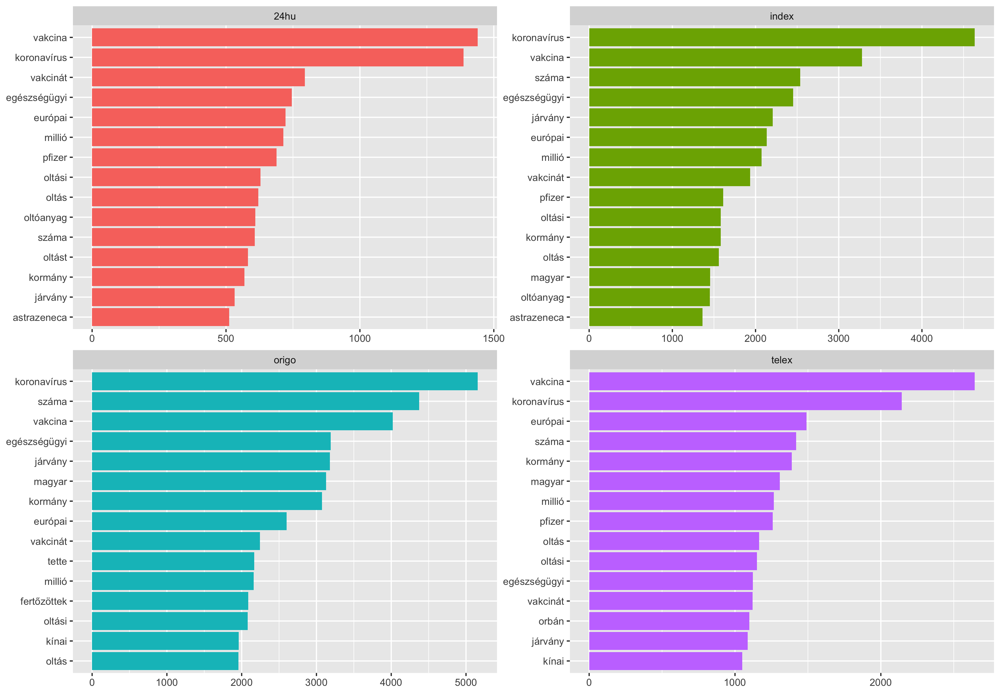{width=90%}</center> 

According to the frequency of the words that are used by news sites, I calculated a correlation matrix and visualized it on a heatmap. From the heatmap below, we can see, that the correlation between the sites is between 0.3 and 0.4, however, within this range there are some differences. It can be observed, that 24.hu is the one that is mostly correlated with the other. The odd one-outs could be telex.hu and origo.hu. To explain this we can note that telex.hu just started working only in the third quarter of 2020, which might somewhat cause this, and origo.hu is the only site among these four that is known to be a pro-government news site. 

```{r, eval=F}
frequency <- tidy_all_sites %>% 
  count(site, word) %>%
  group_by(site) %>%
  mutate(proportion = n / sum(n)) %>% 
  select(-n) %>% 
  spread(site, proportion)

colnames(frequency) <- c("word", "www.24.hu", "www.index.hu", "www.origo.hu", "www.telex.hu")

frequency <- frequency %>% mutate(www.origo.hu = coalesce(www.origo.hu,0),
                            www.telex.hu = coalesce(www.telex.hu,0),
                            www.index.hu = coalesce(www.index.hu,0),
                            www.24.hu = coalesce(www.24.hu,0))

# creating correlation matrix
ds_cor <- frequency %>%
  select(-word) %>% 
  as.matrix() %>%
  rcorr(type = "spearman")
correlation_matrix = as.data.frame(ds_cor$r)


matrix <- as.matrix(correlation_matrix)
diag(matrix) <- NA

heatmap<- ggplot(melt(matrix), aes(x = Var1, y = Var2, fill = value)) +
  geom_tile(colour = "white") +
  labs(x = 'Site', y = 'Site') +
  scale_fill_viridis(alpha = 0.7, begin = 1, end = 0.5, direction = 1, option = "A") +
  #theme_bg() +
  theme(legend.position = "right",
        legend.text = element_text(size=6),
        legend.title =element_text(size=6)
)
```

<center>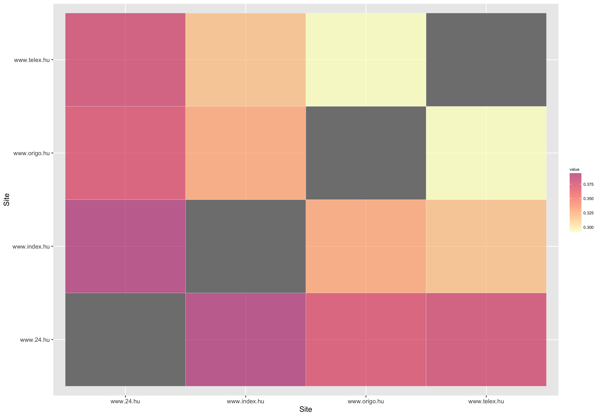{width=90%}</center> 

Also, let’s see another form of comparison between telex.hu and origo.hu according to the frequency of their words. We can see, that telex.hu is using the term vaccine more frequently. Also, I believe it is interesting to highlight, that the pro-governmental origo.hu using respectfully “Orbán Viktor” together, but telex.hu is just using “Orbán” as a standalone term. 

```{r, eval=F}
telex_origo <- ggplot(frequency, aes(x = www.telex.hu, y = www.origo.hu, label = word)) + 
  geom_point(alpha=0.3) +
  geom_text(aes(label=word),hjust=0.5, vjust=-1, alpha=0.5) +
  geom_abline()
)
```

<center>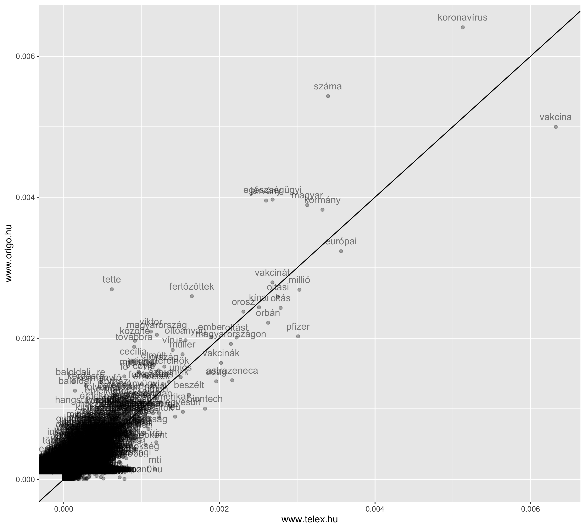{width=90%}</center> 

## TF-IDF

To go deeper than just counting the most frequent words, I used the TF-IDF methodology.
“TF-IDF is a statistical measure that evaluates how relevant a word is to a document in a collection of documents. This is done by multiplying two metrics: how many times a word appears in a document, and the inverse document frequency of the word across a set of documents.” [(source)](https://monkeylearn.com/blog/what-is-tf-idf/#:~:text=TF%2DIDF%20is%20a%20statistical,across%20a%20set%20of%20documents.).

During the process of calculating the TF-IDF metric, I observed the distribution of the term frequency by news site (plot below) on which we can see, that all of them follows a power-law distribution which can be used to validate, that the articles are written by human beings, and not generated by bots. 

```{r, eval=F}
site_words <- all_sites %>% 
  unnest_tokens(word, content_full) %>% 
  count(site, word, sort = TRUE) %>% 
  ungroup()

total_words <- site_words %>% 
  group_by(site) %>% 
  summarise(total = sum(n))

site_words <- left_join(site_words, total_words)

term_freq <- ggplot(site_words, aes(n/total, fill=site)) +
  geom_histogram(show.legend = FALSE) +
  xlim(NA, 0.00015) +
  facet_wrap(~site, ncol=2, scales = "free_y")
```

<center>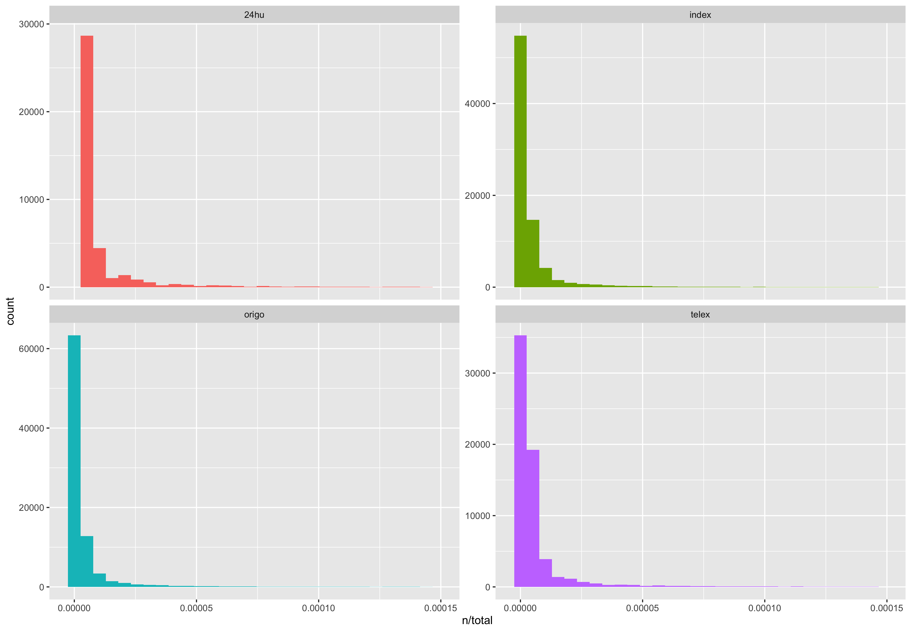{width=90%}</center> 

In the following figure, we can see the most important words used by each news site according to the TF-IDF measure. This plot showed some interesting patterns. First of all, on the news site 24.hu more data cleaning is needed as there are some commercial words included. On the other hand, the pro-government news site has some highly political words like “Gyurcsányné” (the wife of a previous prime minister, and currently part of the Hungarian political opposition), “parkoló” (car parking slots in Budapest is a political hot topic).

```{r, eval=F}
freq_by_rank <- site_words %>% 
  group_by(site) %>% 
  mutate(rank = row_number(),
         term_freq = n/total)
  
site_words <- site_words %>% 
  bind_tf_idf(word, site, n)

tf_idf <- site_words %>% 
  arrange(desc(tf_idf)) %>% 
  mutate(word = factor(word, levels = rev(unique(word)))) %>% 
  group_by(site) %>% 
  top_n(10) %>% 
  ungroup() %>% 
  ggplot(aes(word, tf_idf, fill = site)) +
  geom_col(show.legend = F) +
  labs(x=NULL, y='tf-idf') +
  facet_wrap(~site, ncol=2, scales = "free") +
  coord_flip()
```

<center>{width=90%}</center> 

## Ngram analysis

To dig even deeper, instead of tokenizing articles by word I used tidytext to tokenize by bigrams (word pairs). 

```{r, eval=F}
bigrams_all_sites <- all_sites %>% unnest_tokens(bigram, content_full, token = "ngrams", n = 2) 

# getting hungarian stopwords
hu_stop_word <- read_csv("https://raw.githubusercontent.com/stopwords-iso/stopwords-hu/master/stopwords-hu.txt", col_names = FALSE)
colnames(hu_stop_word) <- "word"

# separating bigrams
bigrams_all_sites <- bigrams_all_sites %>% separate(bigram, c("word1", "word2"), sep = " ", remove  = F)

# filtering out bigrams containing stopwords
filtered_bigrams_all_sites <- bigrams_all_sites %>% 
  filter(!word1 %in% hu_stop_word$word) %>% 
  filter(!word2 %in% hu_stop_word$word)

# some basic summary
summary_bigrams_all_sites <- filtered_bigrams_all_sites %>% 
  count(word1, word2, sort = TRUE)
```

On the plot below, similarly to some previous ones, we can observe the most frequently used word pairs. This turned out to be a very powerful tool on my dataset as it showed some very interesting keywords (pairs). It is not really possible to make real differences between each site, therefore I would like to highlight some common patterns instead.

There are some obvious, pandemic related words:

- covid 19
- fertőzöttek száma (number of infected people)
- Müller Cecília (she is the Chief Medical Officer of Hungary)
- Országos tisztifőorvors (Chief Medical Officer of Hungary)
- Millió adag (million proportions)

Politicians:

- Orbán Viktor
- Gulyás Gergely

Vaccine related keywords

- Pfizer biontech
- Szputnyik V

```{r, eval=F}
bigram_freq <- filtered_bigrams_all_sites %>% 
  group_by(site) %>% 
  count(bigram, sort = TRUE) %>%
  top_n(10) %>%
  mutate(
    site = as.factor(site),
    bigram = reorder_within(bigram, n, site)) %>%
  ggplot(aes(bigram, n, fill=site)) + geom_col(show.legend = FALSE) + xlab(NULL) + coord_flip() +
  facet_wrap(~site, ncol=2, scales = "free") +
  scale_x_reordered()
bigram_freq
```

<center>{width=90%}</center> 

# Sentiment analysis

Another level in analyzing unstructured text is to analyze the sentiment of it. The most interpretable way of doing it is to give a sentiment value to each and every word and aggregate these values into chosen units (sentences, paragraphs, articles). For this sentiment, a sentiment lexicon is needed. With English text, we have plenty of options, which is not the case with Hungarian text. One way could be to translate the whole data to English with some engine and make sentiment analysis on it in English. This is a way that is worth trying for sure, however, for this project, I went in another direction. 
Thanks to some wonderful people there is a [Hungarian Sentiment Lexicon](http://opendata.hu/hu/dataset/hungarian-sentiment-lexicon) already out there in the public web that I used for my analysis. I followed Eduardo’s [example](https://gist.github.com/earino/246256c9161da117701dd0165eb02e61) to make use of this Sentiment lexicon. 

```{r, eval=F}
positive_words <- read_csv("data/PrecoSenti/PrecoPos.txt", col_names = FALSE) %>%
  mutate(sentiment=1)
negative_words <- read_csv("data/PrecoSenti/PrecoNeg.txt", col_names = FALSE) %>%
  mutate(sentiment=-1)

hungarian_sentiment <- rbind(positive_words, negative_words)
colnames(hungarian_sentiment) <- c('word', 'sentiment')

tidy_all_sites_sentiment <- tidy_all_sites %>% inner_join(hungarian_sentiment)
```

In the following plot, I summarized the top words contributing to positive or negative sentiments on each news site. This figure makes sense as the most negative words were:

- járvány (pandemic)
- vírus (virus)
- krónikus (chronic)
- beteg (patient)
- halálos (deadly)
- ferzőzés (infection)

```{r, eval=F}
sentiment_contributions <- tidy_all_sites_sentiment %>%
  group_by(site) %>% 
  count(word, sentiment) %>% 
  mutate(word = reorder_within(word, abs(n), site)) %>%
  top_n(20) %>% 
  mutate(word = reorder_within(word, n, site)) %>%
  ggplot(aes(word, n * sentiment, fill = sentiment)) + geom_col(show.legend = FALSE) +
  labs(y = "Contribution to sentiment", x = NULL) + coord_flip() +
  facet_wrap(~site, ncol=2, scales = "free") +
  scale_x_reordered()
```

<center>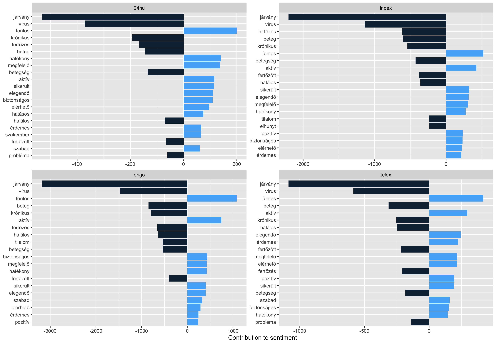{width=90%}</center> 

However, this also highlighted some interesting errors with this sentiment dictionary. It is not the fault of the dictionary as it is for general purposes. My finding was, that in covid context the word active has mostly negative sentiment opposite to the usual meaning due to “active covid cases”. Also the terms “negative” and “positive” have inverse sentiment in covid context (“positive test results”). By using bigrams I filtered for word pairs containing the terms above, and it turned out the for most of the cases, my assumption above was right, however not always, as they have been used with their usual meaning as well. As these words were in the top ones (contributing to sentiment results), I made the decision to exclude them from the sentiment dictionary for this time, to give them a neutral weight. 

As all the articles were scraped with timestamp metadata, I was able to visualize the change of sentiment over time. As an exploratory data analysis, I did it with daily aggregation as well, but I found weekly aggregation more meaningful and less noisy. The figure below proves, that reading Hungarian covid-19 news, is somewhat depressing most of the time, as it shows the average sentiment of the observed news sites on a weekly basis. 

```{r, eval=F}
weekly_sentiment_score <- tidy_all_sites_sentiment %>% 
  group_by(year = year(date),
           week = week(date)) %>% 
  summarise( daily_sentiment_norm = sum(sentiment)/n(),
             n=n(),
             daily_sentiment= sum(sentiment)) %>% 
  mutate( date = make_date(year) + weeks(week))

ggplot(weekly_sentiment_score, aes(x=date,y=daily_sentiment_norm)) +
  geom_col(show.legend = FALSE)
```

<center>{width=90%}</center> 

Furthermore, on the next plot we can observe similar plots grouped by news sites. We can see that indeed, telex.hu started only functioning in the 3rd quarter of 2020 with massively negative covid news. 24.hu seems to be kind of neutral compared to the others. Also, we can see some patterns as well but they are far from correlating with each other. This plot also highlights that there are probably some data quality or sentiment dictionary issues as there should not be such positive spikes. 

```{r, eval=F}
weekly_sentiment_score <- tidy_all_sites_sentiment %>% 
  group_by(year = year(date),
           week = week(date),
           site) %>% 
  summarise( daily_sentiment_norm = sum(sentiment)/n(),
             n=n(),
             daily_sentiment= sum(sentiment)) %>% 
  mutate( date = make_date(year) + weeks(week))

ggplot(weekly_sentiment_score, aes(x=date,y=daily_sentiment_norm, fill = site)) +
  geom_col(show.legend = FALSE) +
  facet_wrap(~site, ncol = 1, scales = "free_y")
```

<center>{width=90%}</center>

Also, with the ngram analysis, we can analyse the contribution of words like “not” (in Hungarian: “nem”).  With the following lines of code, I showed the top words that are followed “nem”(not) that had the largest impact on the sentiment. We can see, that most of these words have positive sentiment, meaning that the sentiment plots showed before should be even more negative in reality.

```{r, eval=F}
bigrams_all_sites %>% 
  filter(word1 == 'nem') %>% 
  count(bigram, sort = TRUE)

not_words <- bigrams_all_sites %>% 
  filter(word1 == 'nem') %>% 
  inner_join(hungarian_sentiment, by = c(word2 = 'word')) %>% 
  count(word2, sentiment, sort = TRUE) %>% 
  ungroup()

not_words_contribution <- not_words %>%  
  mutate(contribution = n * sentiment) %>% 
  arrange(desc(abs(contribution))) %>% 
  head(20) %>% 
  mutate(word2 = reorder(word2, contribution)) %>% 
  ggplot(aes(word2, contribution, fill = contribution > 0)) +
  geom_col(show.legend = F) +
  xlab('Word preceded by "nem" which is the hungarian form of "not".') +
  ylab('Sentiment score * number of occurences') +
  coord_flip()
```

<center>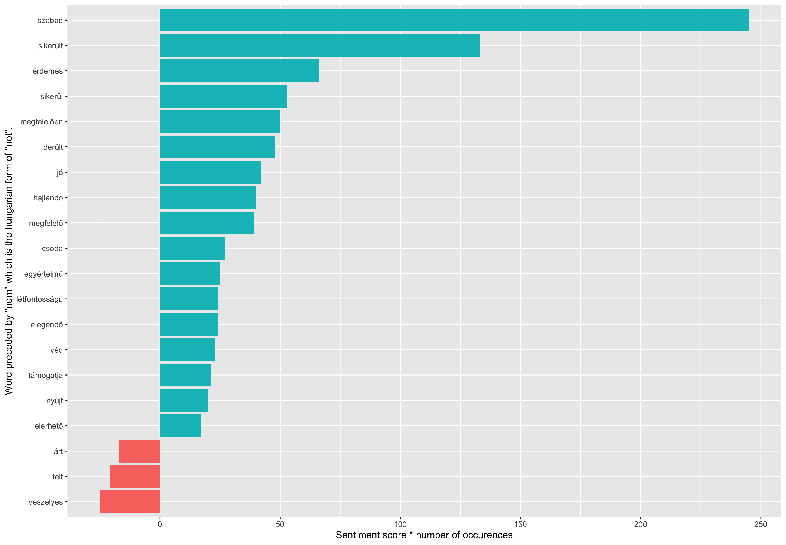{width=90%}</center>

## Topic modelling: LDA

To cluster articles into some natural groups according to their content I tried a topic modeling method called LDA (Latent Dirichlet allocation). By that, we can treat each article as a mixture of topics. 

On a basic level, we can do LDA easily with the help of the “topicmodels” package. With just a few lines of code, I managed to define 2 different topics with the following typical words. It is hard to differentiate the two topics (probably because the data collection is filtered on one keyword, and subtopic are highly connected to each other), but we could say, that topic 1 is more about “how the Hungarian government handles covid-19” and topic 2 is “healthcare system and vaccination”. 

```{r, eval=F}
art_lda_2 <- LDA(word_all_sites_by_article_dtm, k = 2, control = list(seed = 1234))
art_topics_2 <- tidy(art_lda_2, matrix = "beta")

art_top_terms_2 <- art_topics_2 %>%
  group_by(topic) %>%
  top_n(10, beta) %>%
  ungroup() %>%
  arrange(topic, -beta)

art_topics_plot_2 <- art_top_terms_2 %>%
  mutate(term = reorder_within(term, beta, topic)) %>%
  ggplot(aes(term, beta, fill = factor(topic))) +
  geom_col(show.legend = FALSE) +
  facet_wrap(~ topic, scales = "free") +
  coord_flip() +
  scale_x_reordered()
```

<center>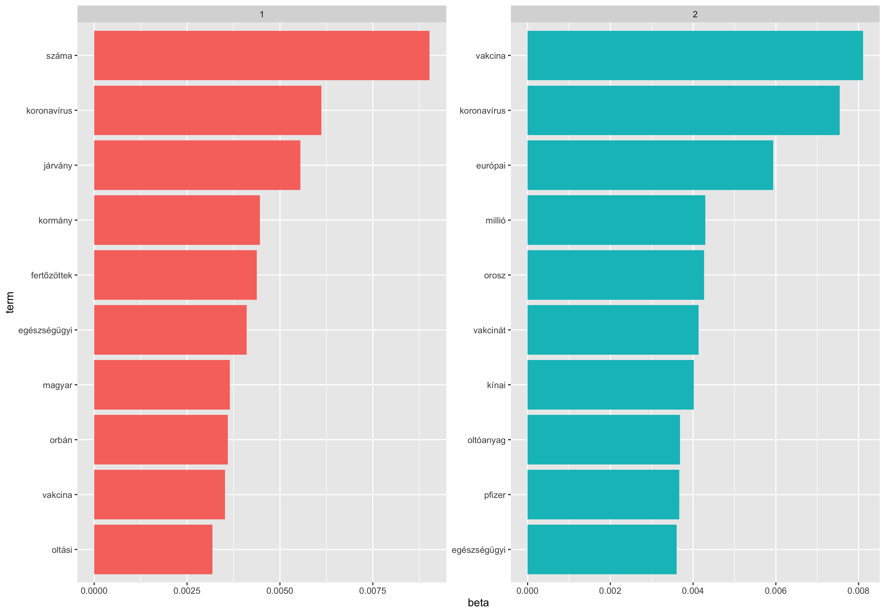{width=90%}</center>

Also with few lines of code, I clustered each article into one of the groups, and on a box plot, we can observe how the articles distributed between the topics within each news site. As I mentioned before, topic 1 is more about the Hungarian government and topic 2 about the healthcare system and vaccination. This aligns with the fact, that among the four new sites in the project origo.hu is the only pro-government news site as the pattern is different compared to the others.

```{r, eval=F}
gamma <- art_lda_2 %>%
  tidy(matrix = "gamma")

tmp <- left_join(gamma, all_sites, by = c("document" = "title"))

plot_2 <- tmp %>% 
  mutate(site = reorder(site, gamma * topic)) %>%
  ggplot(aes(factor(topic), gamma)) +
  geom_boxplot() +
  facet_wrap(~ site) +
  labs(x = "Topic",
       y = "# of messages where this was the highest % topic")
```

<center>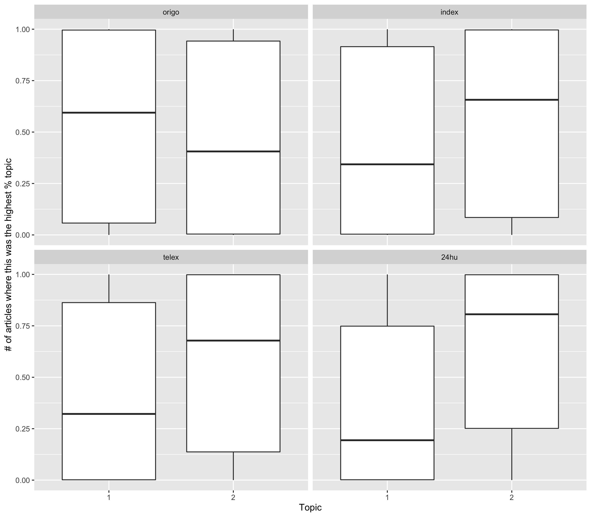{width=90%}</center>

As we have four news sites it seemed to worth trying four different topics. I would label the following topics as the following according to my Hungarian knowledge.

- Topic 1: Pandemic healthcare system
- Topic 2: Vaccination
- Topic 3: Hungarian government
- Topic 4: Pandemic stats

```{r, eval=F}
art_lda_4 <- LDA(word_all_sites_by_article_dtm, k = 4, control = list(seed = 1234))
art_topics_4 <- tidy(art_lda_4, matrix = "beta")

art_top_terms_4 <- art_topics_4 %>%
  group_by(topic) %>%
  top_n(10, beta) %>%
  ungroup() %>%
  arrange(topic, -beta)

art_topics_plot_4 <- art_top_terms_4 %>%
  mutate(term = reorder_within(term, beta, topic)) %>%
  ggplot(aes(term, beta, fill = factor(topic))) +
  geom_col(show.legend = FALSE) +
  facet_wrap(~ topic, scales = "free") +
  coord_flip() +
  scale_x_reordered()
```

<center>{width=90%}</center>

On the following familiar plot we can see, that regarding topic 1, most of the sites are doing similar. About topic 2 (vaccination) origo.hu is writing less than others. Also, with topic 3. (Hungarian Government) the odd-one-out is still orgio.hu. On topic four I would not highlight any meaningful pattern.

```{r, eval=F}
gamma <- art_lda_4 %>%
  tidy(matrix = "gamma")

tmp <- left_join(gamma, all_sites, by = c("document" = "title"))

plot_4 <- tmp %>% 
  mutate(site = reorder(site, gamma * topic)) %>%
  ggplot(aes(factor(topic), gamma)) +
  geom_boxplot() +
  facet_wrap(~ site) +
  labs(x = "Topic",
       y = "# of messages where this was the highest % topic")
```

<center>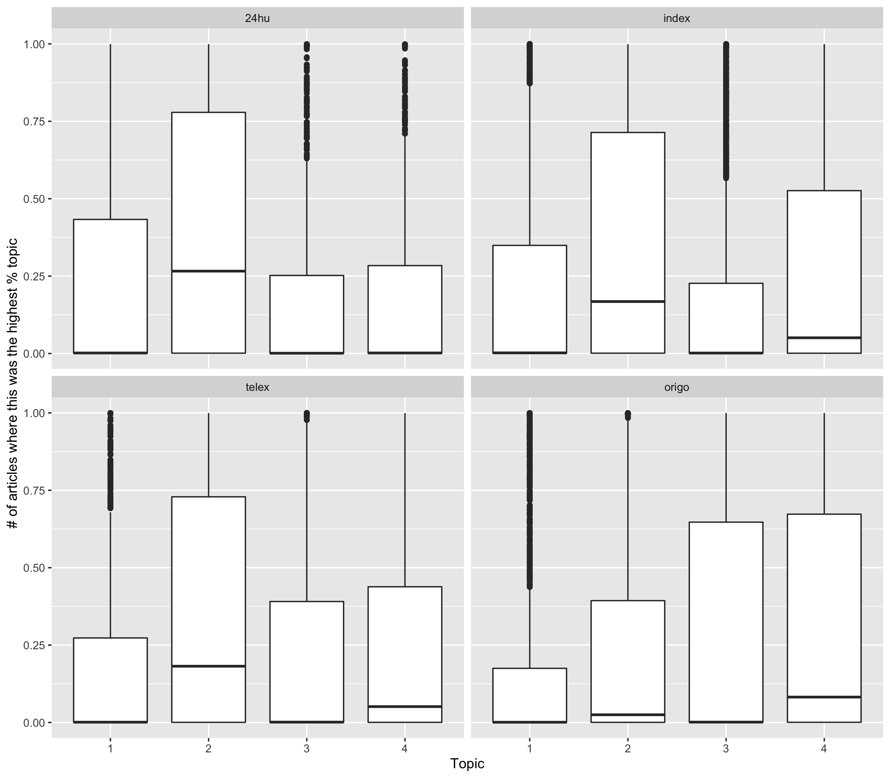{width=90%}</center>

# Networks

To visualize the collected bigrams that were described in a previous chapter we can also use graphs using the ggraph package. First, let’s see a graph where nodes are words and they are connected with a weighted edge if they were used together a lot of times. 

To highlight some distinct groups, on the left side we can see a group that is mostly about covid-statistics (number of infections). In the middle, there is a group talking about the Russian and the Chinese vaccine.

```{r, eval=F}
set.seed(2021)
network_all <- summary_bigrams_all_sites %>%
  filter(n >= 300) %>%
  graph_from_data_frame() %>%
  ggraph(layout = "fr") +
  geom_edge_link(aes(edge_alpha = 0.6, edge_width = n), edge_colour = "cyan4") +
  geom_node_point(size = 5) +
  geom_node_text(aes(label = name), repel = TRUE, 
                 point.padding = unit(0.2, "lines")) +
  theme_void()
```

<center>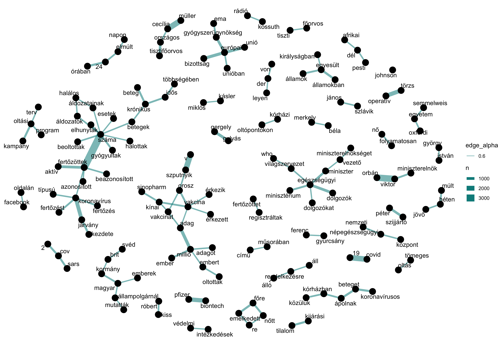{width=90%}</center>

On the other hand, with graph visualization, I think we can do better than just showing bigrams. With the “widyr” package, we can observe connections between words that appeared in the same article. 

Again, with some lines of code here is the network of the most frequently co-occurred words in all the articles from all news sites. We can see that the main center point are “koronavírus” (covid-19), “vakcina” (vaccine), “járvány” (pandemic), “száma” (number of), and there are some separated but interesting groups like “Orbán Viktor” and “operatív törzs”(Hungarian organization that is handling the pandemic situation).

```{r, eval=F}
tidy_all_sites_by_article <- all_sites %>% 
  unnest_tokens(word, content_full) %>% 
  filter(!str_detect(word, "\\d+")) %>% 
  anti_join(hu_stop_word) %>% 
  count(title, word)

coocurring_words <- tidy_all_sites_by_article %>% pairwise_count(word, title, sort = TRUE, upper = FALSE)
saveRDS(coocurring_words, file = 'data/raw/coocurring_words_content.rds')


set.seed(1234)
coocurring_words_content_plot <- coocurring_words %>%
  filter(n >= 1050) %>%
  graph_from_data_frame() %>%
  ggraph(layout = "fr") +
  geom_edge_link(aes(edge_alpha = n, edge_width = n), edge_colour = "cyan4") +
  geom_node_point(size = 5) +
  geom_node_text(aes(label = name), repel = TRUE, 
                 point.padding = unit(0.2, "lines")) +
  theme_void()+
  ggtitle("Co-occuring words in the content of articles")
```

<center>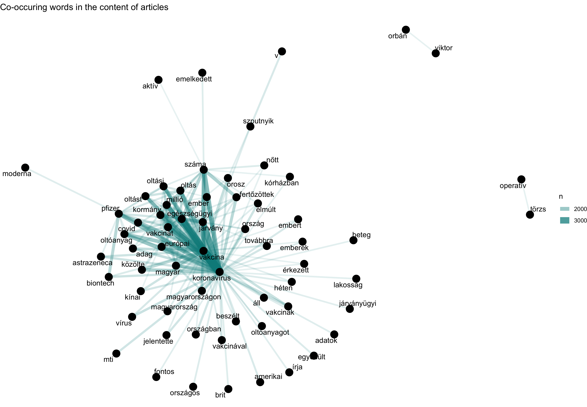{width=90%}</center>

Also, with the same logic, I created the network of the co-occurring words in the title of articles, which shows an even more interesting pattern. It has three main groups:

- on the left side: stats about covid
- in the middle: pandemic general
- in the bottom: vaccination

```{r, eval=F}
# with content of titles
tidy_all_sites_by_title <- all_sites %>% 
  unnest_tokens(word, title, drop=F) %>% 
  filter(!str_detect(word, "\\d+")) %>% 
  anti_join(hu_stop_word) %>% 
  count(title, word)

coocurring_words_title <- tidy_all_sites_by_title %>% pairwise_count(word, title, sort = TRUE, upper = FALSE)
saveRDS(coocurring_words_title, file = 'data/raw/coocurring_words_title.rds')

set.seed(1234)

coocurring_words_content_plot_title <- coocurring_words_title %>%
  filter(n >= 15) %>%
  graph_from_data_frame() %>%
  ggraph(layout = "fr") +
  geom_edge_link(aes(edge_alpha = n, edge_width = n), edge_colour = "cyan4") +
  geom_node_point(size = 5) +
  geom_node_text(aes(label = name), repel = TRUE, 
                 point.padding = unit(0.2, "lines")) +
  theme_void()+
  ggtitle("Co-occuring words in all article titles")
```

<center>{width=90%}</center>

Finally, let’s see the co-occurring words in the titles site by site. The interpretation of them is pretty straightforward by the nature of the graph visualization and we can say that the patterns are mostly the same at all news sites. 

<center>{width=70%}</center>

<center>{width=70%}</center>

<center>{width=70%}</center>

<center>{width=70%}</center>

## Conclusion

As a conclusion, I would like to highlight the power of R and the used packages in text mining and analysis. With the help of simple scripts, it is possible to get the main content out from thousands of articles and visualize them in an interpretable way. 
Also, I feel that this project could be an ongoing project as there are endless improvement possibilities in the following areas.

- Scraping other news sites
- More data cleaning for better quality
- Trying to translate to English and use English dictionaries
- Use covid related dictionaries
- Deeper topic modeling
- Deeper network analysis


